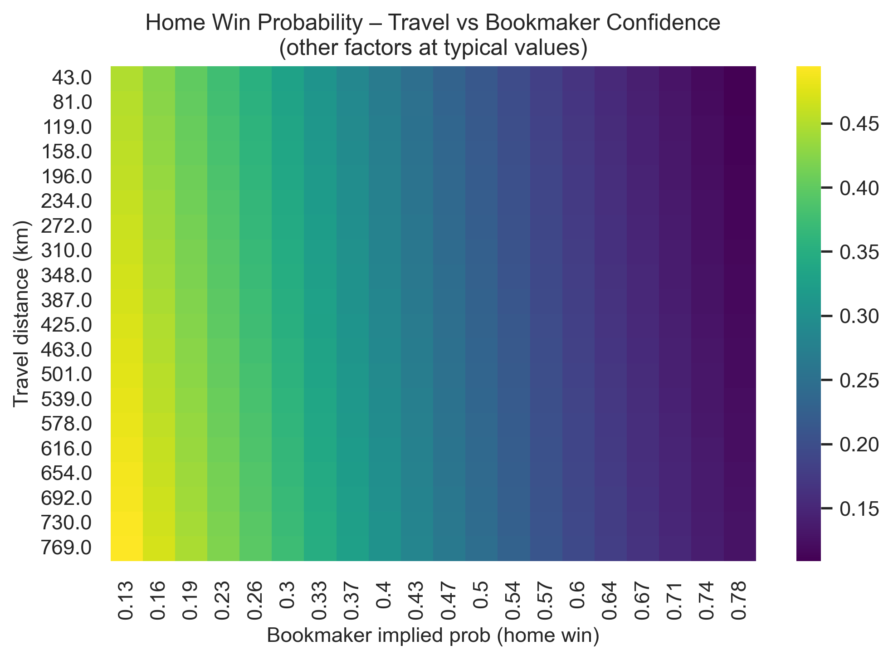
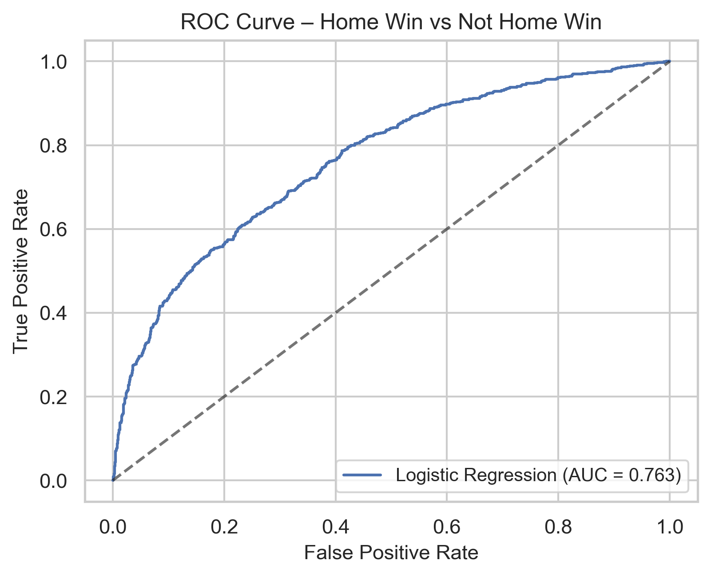

Weather & Match Conditions — Predicting Home Win Probability (Machine Learning Analysis)
Executive Summary

This project builds an interpretable machine-learning model to estimate home win probability using external match conditions: weather, travel distance, implied team strength, attendance context, and rest patterns.
The goal is to understand how these non-tactical factors influence match outcomes and to demonstrate a modern football-analytics modeling workflow.

The workflow includes data processing, feature engineering, logistic regression with standardized effects, probability calibration, model comparison, and counterfactual interaction visualizations.

1. Why This Analysis Matters

Match performance depends on more than tactics and player quality.
External conditions shape performance through:

Physical strain from long-distance travel

Reduced efficiency under high humidity, heat, or wind

Discrepancies between bookmaker expectations and environmental realities

Attendance, rest days, and scheduling dynamics

Contextual effects that combine in non-linear ways

This project quantifies these influences and provides a structure for integrating external-condition modeling into football analytics pipelines.

2. Data Sources

The datasets used in this project were derived from the following sources:

- **Primary match + odds dataset:**  
  Enrico Cattaneo — *Football Match Prediction Dataset* (Kaggle).  
  Available at: https://www.kaggle.com/datasets/enricocattaneo/data-football-match-prediction  
  Used for: match outcomes, home/away identifiers, bookmaker implied probabilities, venue metadata.

- **Weather data:**  
  Weather variables (temperature, humidity, windspeed, conditions) obtained from the processed  
  `weather_output.csv` file, originally generated using Open-Meteo API calls matched by stadium and date.

- **Venue & league metadata:**  
  Additional structural context from the raw tables:  
  `1_venue.csv`, `leagues_more.csv`, and `5_odds.csv`.

All cleaned feature tables are available in:  
`data/processed/matches_modeling_dataset.csv`.

3. Repository Structure

data/
• processed:
 – matches_modeling_dataset.csv
• raw:
 – 1_venue.csv
 – 5_odds.csv
 – leagues_more.csv
 – weather_output.csv

notebooks/
• 01_data_processing.ipynb
• 02_modeling.ipynb
• 03_reporting.ipynb

visuals/
• Calibration curves
• Confusion matrices (multiple models)
• Feature importance (standardized effects)
• Interaction heatmaps (temp × humidity, travel × bookmaker)
• PDP plots (temp, humidity, travel_km, implied probability, windspeed, attendance ratio)
• ROC curves (single model + all-models comparison)

root files
• .gitignore
• LICENSE
• README.md

4. Modeling Overview

This analysis uses an interpretable predictive pipeline:

Logistic Regression (final selected model)

Standardized feature effects

Train/test split + cross-validation

Probability calibration (reliability curves)

ROC/AUC comparison across multiple models

Counterfactual heatmaps for understanding non-linear interactions

Partial dependence analysis for marginal effects

Feature Groups

Weather

Temperature

Humidity

Windspeed

Weather category indicators

Contextual / Matchday

Attendance ratio

Rest days

Team Strength Proxy

Home-team implied probability from bookmaker odds

Travel

Travel distance (km)

Interactions with implied team strength

5. Visual Examples
Feature Importance (Standardized Effects)

Interaction — Temperature × Humidity

Interaction — Travel × Bookmaker Implied Probability

ROC Curve (Logistic Regression)

Partial Dependence — Temperature

## Visual Examples

### Feature Importance (Standardized Effects)

### Interaction Effect — Temperature × Humidity

### Interaction Effect — Travel Distance × Bookmaker Probability

### ROC Curve (Logistic Regression)

### Partial Dependence — Temperature

6. Key Insights

1. Weather conditions materially impact results.
Extreme humidity or heat suppresses predicted home win odds even after accounting for team strength.

2. Travel burden imposes a measurable penalty.
Long travel distances reduce modeled win probability, especially when paired with challenging weather.

3. Bookmaker implied probability is strong but not sufficient.
Environmental and situational factors create real deviations from market expectations.

4. Interaction effects reveal compound disadvantages.
Weather + travel + kickoff context generate effects far larger than individual variables alone.

7. Limitations & Future Work

Add lineup-level features (player availability, fatigue)

Integrate xG-based team form inputs

Explore non-linear models (XGBoost, Random Forests)

Develop a real-time prediction dashboard or API

8. License

Released under the MIT License.

Contact

Arnav Jain Master of Science in Data Science, University of Virginia LinkedIn: https://www.linkedin.com/in/arnavjain2026/

For collaboration or football-analytics opportunities, feel free to reach out.

